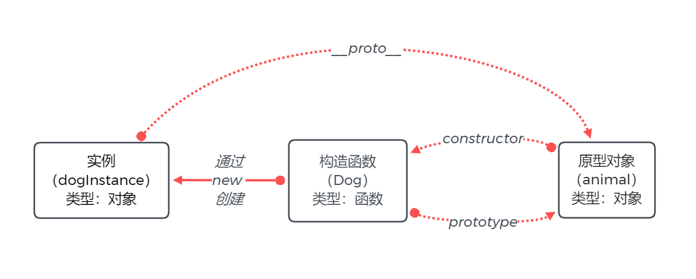

# Prototype
## 概念辨析
三个概念：构造器函数、实例、原型对象

三个属性：prototype、\_\_proto__ 、constructor
### 构造器函数
|  数据类型   | 使用方法  | 包含属性  |
|  ----  | ----  | ----  |
| 函数  | 使用 new 运算符，创建一个构造器函数的实例 |prototype|

例
```
// 一个狗狗类的构造器函数
function Dog() {}
// 使用 new 运算符，创建一个构造器函数Dog的实例dogInstance
var dogInstance = new Dog() 
```
### 实例
|  数据类型   | 使用方法  | 包含属性  |
|  ----  | ----  | ----  |
| 对象  | 由构造器函数通过 new 运算符创建 |\_\_proto__|

### 原型对象
|  数据类型   | 使用方法  | 包含属性  |
|  ----  | ----  | ----  |
| 对象  | 由构造器函数通过prototype属性引用，由实例通过\_\_proto__属性引用 |constructor|

例
```
// 一个动物原型对象
var animal = {type: '动物'}
// 一个狗狗类的构造器函数
function Dog() {}
// 一个狗狗类的构造器函数指向原型对象
Dog.prototype = animal
// 原型对象的constructor属性引用构造器函数
animal.constructor = animal
// 使用 new 运算符，创建一个构造器函数Dog的实例dogInstance
var dogInstance = new Dog()
// 实例的__proto__与构造器函数的prototype都指向原型对象
console.log(dogInstance.__proto__ === Dog.prototype) // true
```
图



## 关于Object
原型对象是对象，因此都继承Object.prototype对象，Object.prototype对象是原型链的终点，Object.prototype.\_\_proto__ 的值为null。
```
var instance = new Object()
console.log(instance.__proto__ === Object.prototype) // true
console.log(Object.prototype.__proto__) // null
```


## 关于Function
函数也是对象，因此构造器函数也可当做实例，由Function构造器函数创建。
```
var Dog = new Function()
console.log(Dog.__proto__ === Function.prototype)// true
console.log(Function.__proto__ === Function.prototype)// true
console.log(Object.__proto__ === Function.prototype)// true
```


##  关于class

```
class A {}
var a = new A()
console.log(typeof A) // function
console.log(a.__proto__ === A.prototype) // true
class B extends a {}
var b = new B()
console.log(B.prototype.__proto__ === A.prototype) // true
```